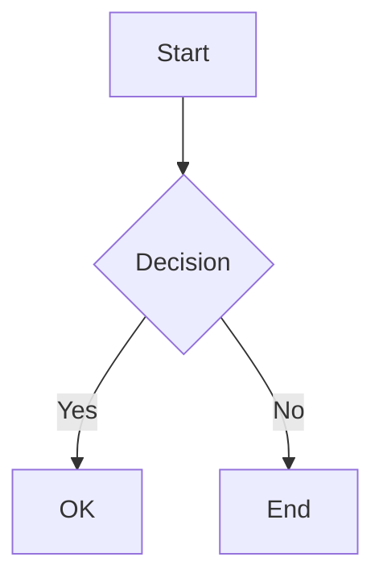
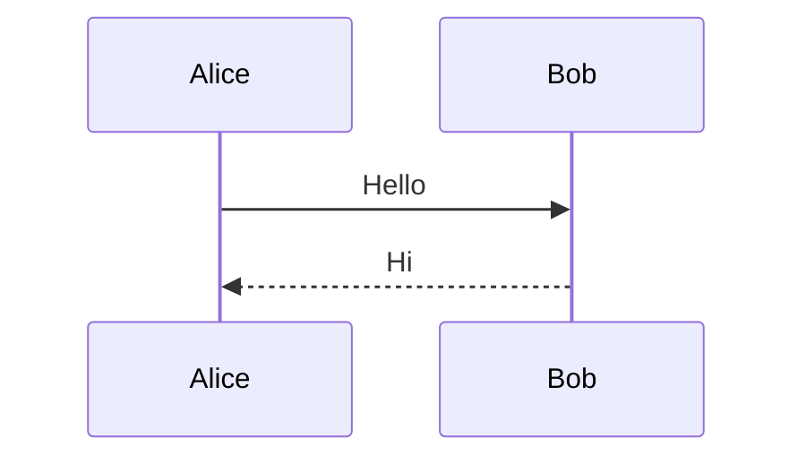

# TUI Diagrams

Terminal-friendly diagram rendering library for Go. Render flowcharts, sequence diagrams, and charts using Unicode box-drawing characters.

## Features

- **Flowcharts**: Vertical and horizontal flow diagrams with multiple node shapes
- **Sequence Diagrams**: Actor-based interaction diagrams with lifelines
- **Bar Charts**: Horizontal and vertical charts with ANSI color support
- **Zero Dependencies**: Uses only the Go standard library
- **Unicode Box Drawing**: Clean terminal output with proper box-drawing characters
- **TUI Framework Integration**: Works seamlessly with `github.com/orchard9/tui`

## Installation

```bash
go get github.com/orchard9/tui-diagrams
```

## Quick Start Demo

Run the quick demo to see all features in action:

```bash
go run demo.go
```

This shows:
- Flowcharts with decision nodes
- Sequence diagrams with actors
- Bar charts (horizontal and vertical with colors)
- Mermaid syntax parsing (flowchart and sequence)

## Full Demo

For a comprehensive showcase with more examples:

```bash
go run cmd/demo/main.go
```

This will showcase:
- Authentication flowchart with decision nodes
- CI/CD pipeline (horizontal)
- E-commerce microservices sequence diagram
- Programming language popularity chart
- Sprint velocity chart with colors
- System resource usage dashboard
- Performance optimization comparisons
- Project status tracking
- Team distribution charts
- **Mermaid flowchart from syntax** (parser demo)
- **Mermaid sequence diagram from syntax** (parser demo)

## Mermaid Syntax Support

Render Mermaid diagrams from **Markdown files** (`.md`) or **standalone Mermaid files** (`.mmd`):

```bash
# Markdown files with ```mermaid code blocks
go run cmd/mermaid-render/main.go example.md

# Standalone .mmd files
go run cmd/mermaid-render/main.go examples/authentication.mmd
go run cmd/mermaid-render/main.go examples/api-flow.mmd
```

**Supported Mermaid Syntax:**

Flowcharts:
````markdown

````

Sequence Diagrams:
````markdown

````

**From Code:**

```go
// Parse standalone .mmd file
diagram, err := diagrams.ParseMmdFile("authentication.mmd")
fmt.Println(diagram.Render())

// Extract all Mermaid diagrams from a Markdown file
diagrams, err := diagrams.ParseMermaidFromFile("README.md")

// Or extract from Markdown string
blocks, err := diagrams.ExtractMermaidFromMarkdown(markdownContent)
for _, block := range blocks {
    if block.Diagram != nil {
        fmt.Println(block.Diagram.Render())
    }
}

// Parse specific diagram types
flow, err := diagrams.ParseMermaidFlowchart(mermaidText)
seq, err := diagrams.ParseMermaidSequence(mermaidText)
```

**Example Files:**
- `example.md` - Markdown with 5 Mermaid diagrams
- `examples/authentication.mmd` - Flowchart (vertical, decision tree)
- `examples/api-flow.mmd` - Sequence diagram (API flow)
- `examples/cicd-pipeline.mmd` - Flowchart (horizontal, CI/CD pipeline)

## Quick Start

### Flowchart

```go
import "github.com/orchard9/tui-diagrams/pkg/diagrams"

flow := diagrams.NewFlowchart(diagrams.TopToBottom)

flow.AddNode("start", "Start", diagrams.ShapeRounded).
    AddNode("process", "Process Data", diagrams.ShapeBox).
    AddNode("decision", "Valid?", diagrams.ShapeDiamond).
    AddNode("end", "End", diagrams.ShapeRounded)

flow.AddEdge("start", "process", "").
    AddEdge("process", "decision", "").
    AddEdge("decision", "end", "yes")

fmt.Println(flow.Render())
```

**Output:**
```
╭─────────╮
│ Start   │
╰─────────╯
    ↓
┌──────────────┐
│ Process Data │
└──────────────┘
    ↓
    ◆
< Valid? >
    ◆
    │ yes
    ↓
╭─────╮
│ End │
╰─────╯
```

### Sequence Diagram

```go
seq := diagrams.NewSequenceDiagram()

seq.AddActor("user", "User").
    AddActor("server", "Server").
    AddActor("db", "Database")

seq.AddMessage("user", "server", "Login", diagrams.MessageSync).
    AddMessage("server", "db", "Query", diagrams.MessageSync).
    AddMessage("db", "server", "Result", diagrams.MessageReturn).
    AddMessage("server", "user", "Token", diagrams.MessageReturn)

fmt.Println(seq.Render())
```

**Output:**
```
    User          Server        Database
┌──────────┐  ┌──────────┐  ┌──────────┐
     │              │              │
     │──Login──────→│              │
     │              │              │
     │              │──Query──────→│
     │              │              │
     │              │←───Result────│
     │              │              │
     │←────Token────│              │
     │              │              │
└──────────┘  └──────────┘  └──────────┘
```

### Bar Chart

```go
chart := diagrams.NewBarChart("Monthly Sales", diagrams.Horizontal)

chart.AddBar("January", 45).
    AddBar("February", 67).
    AddBar("March", 89).
    SetWidth(40)

fmt.Println(chart.Render())
```

**Output:**
```
Monthly Sales
=============

January  │ ████████████████████            45
February │ ██████████████████████████████  67
March    │ ████████████████████████████████████████  89
```

## API Reference

### Flowchart

**Create a flowchart:**
```go
flow := diagrams.NewFlowchart(direction diagrams.Direction)
```

**Directions:**
- `diagrams.TopToBottom` - Vertical layout (default)
- `diagrams.LeftToRight` - Horizontal layout

**Add nodes:**
```go
flow.AddNode(id string, label string, shape diagrams.NodeShape)
```

**Node Shapes:**
- `diagrams.ShapeBox` - Rectangle (for processes)
- `diagrams.ShapeRounded` - Rounded corners (for start/end)
- `diagrams.ShapeDiamond` - Diamond (for decisions)
- `diagrams.ShapeCircle` - Circle (for connectors)

**Add edges:**
```go
flow.AddEdge(from string, to string, label string)
```

**Render:**
```go
output := flow.Render() // Returns string
```

### Sequence Diagram

**Create a sequence diagram:**
```go
seq := diagrams.NewSequenceDiagram()
```

**Add actors:**
```go
seq.AddActor(id string, name string)
```

**Add messages:**
```go
seq.AddMessage(from string, to string, label string, msgType diagrams.MessageType)
```

**Message Types:**
- `diagrams.MessageSync` - Solid arrow (synchronous call)
- `diagrams.MessageAsync` - Dashed arrow (asynchronous)
- `diagrams.MessageReturn` - Dashed arrow pointing back (return)

**Self-calls:**
```go
seq.AddMessage("actor1", "actor1", "Process", diagrams.MessageSync) // Auto-detected
```

**Render:**
```go
output := seq.Render() // Returns string
```

### Bar Chart

**Create a bar chart:**
```go
chart := diagrams.NewBarChart(title string, orientation diagrams.BarOrientation)
```

**Orientations:**
- `diagrams.Horizontal` - Bars extend left to right
- `diagrams.Vertical` - Bars extend bottom to top

**Add bars:**
```go
chart.AddBar(label string, value float64)
chart.AddBarWithColor(label string, value float64, color string) // ANSI color
```

**ANSI Colors:**
```go
chart.AddBarWithColor("Frontend", 85, "\x1b[32m") // Green
chart.AddBarWithColor("Backend", 92, "\x1b[34m")  // Blue
chart.AddBarWithColor("DevOps", 78, "\x1b[36m")   // Cyan
```

**Configure:**
```go
chart.SetWidth(50)        // Chart width
chart.SetHeight(12)       // Chart height (vertical only)
chart.SetShowValues(true) // Display values
```

**Render:**
```go
output := chart.Render() // Returns string
```

## TUI Framework Integration

Use diagrams in interactive terminal applications with the [TUI framework](https://github.com/orchard9/tui):

```go
import (
    "github.com/orchard9/tui/pkg/tui"
    "github.com/orchard9/tui-diagrams/pkg/diagrams"
)

type model struct {
    diagram diagrams.Diagram
}

func (m model) View() string {
    return m.diagram.Render()
}

func main() {
    flow := diagrams.NewFlowchart(diagrams.TopToBottom)
    flow.AddNode("start", "Start", diagrams.ShapeRounded)
    // ... configure diagram

    p := tui.NewProgram(model{diagram: flow})
    p.Run()
}
```

See `examples/tui-integration/` for a complete interactive diagram viewer.

## Examples

Run the examples to see diagrams in action:

```bash
# Flowchart examples
cd examples/flowchart && go run main.go

# Sequence diagram examples
cd examples/sequence && go run main.go

# Bar chart examples
cd examples/barchart && go run main.go

# Interactive TUI integration
cd examples/tui-integration && go run main.go
```

## Unicode Box-Drawing Characters

The library uses Unicode box-drawing characters for clean terminal output:

**Single-line:**
- `│` Vertical
- `─` Horizontal
- `┌` `┐` `└` `┘` Corners
- `┬` `┴` `├` `┤` `┼` Junctions

**Double-line:**
- `║` `═` Vertical/Horizontal
- `╔` `╗` `╚` `╝` Corners

**Arrows:**
- `→` Right
- `←` Left
- `↑` Up
- `↓` Down

## Testing

Run the comprehensive test suite:

```bash
go test ./pkg/diagrams -v
```

All 28 tests cover:
- Flowchart rendering (vertical, horizontal, all shapes)
- Sequence diagram rendering (actors, messages, self-calls)
- Bar chart rendering (horizontal, vertical, colors)
- Edge cases (empty diagrams, truncation, padding)

## Design Principles

1. **Simple API**: Fluent builder pattern for easy diagram construction
2. **Terminal-First**: Optimized for monospace fonts and terminal rendering
3. **Zero Dependencies**: Only uses Go standard library
4. **Composability**: All diagrams implement `Diagram` interface
5. **Extensibility**: Easy to add new diagram types

## Companion Libraries

- **[tui](https://github.com/orchard9/tui)** - Terminal UI framework (The Elm Architecture)
- **[tui-styles](https://github.com/orchard9/tui-styles)** - Fluent styling API with borders and layouts
- **[get-ansi](https://github.com/orchard9/get-ansi)** - ANSI escape code utilities

## Limitations

- **Mermaid Syntax**: This library uses a programmatic API, not Mermaid text syntax parsing
- **Complex Layouts**: Flowcharts are simple (no automatic layout algorithms like Graphviz)
- **Terminal Size**: Large diagrams may exceed terminal width (no automatic wrapping)
- **Unicode Support**: Requires terminal with Unicode box-drawing character support

For advanced diagramming, consider generating images and displaying in terminal with tools like `catimg` or `timg`.

## License

MIT

## Contributing

Contributions welcome! Please:
1. Run tests: `go test ./pkg/diagrams -v`
2. Format code: `go fmt ./...`
3. Check quality: `go vet ./...`
4. Update README if adding features

## Acknowledgments

Inspired by:
- [Mermaid](https://mermaid.js.org/) - Diagram syntax and types
- [Graphviz](https://graphviz.org/) - Graph visualization
- [asciigraph](https://github.com/guptarohit/asciigraph) - Terminal charts
- [go-chart](https://github.com/wcharczuk/go-chart) - Go charting library
