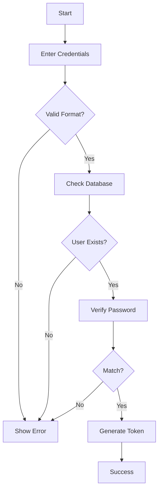
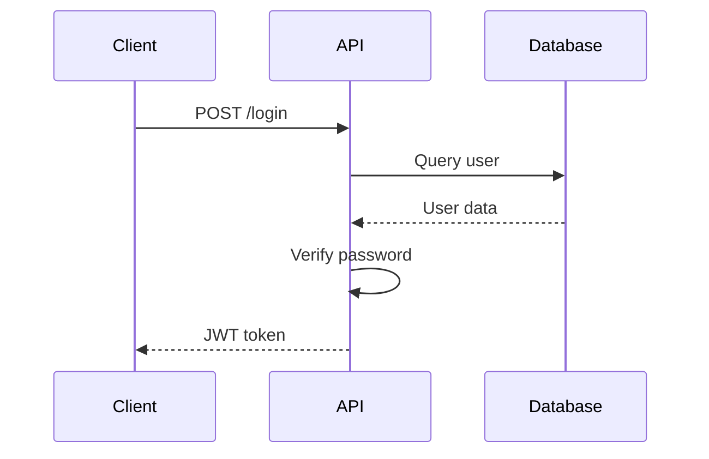
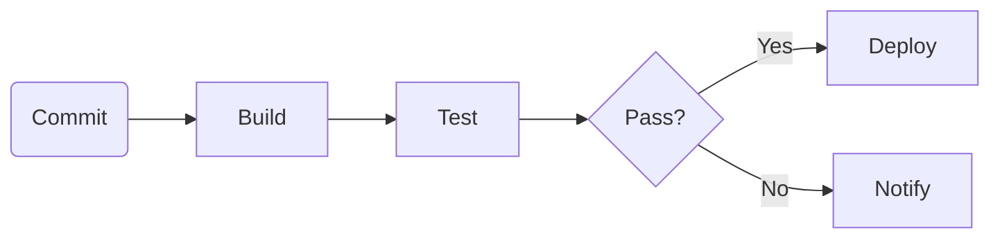
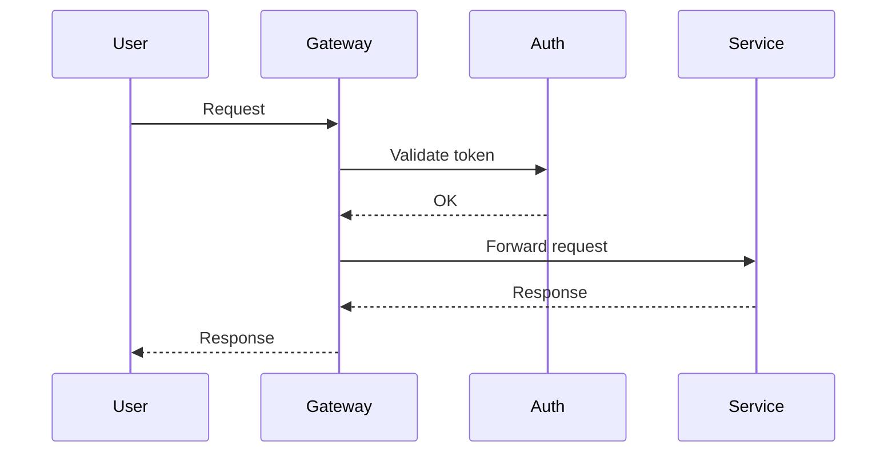
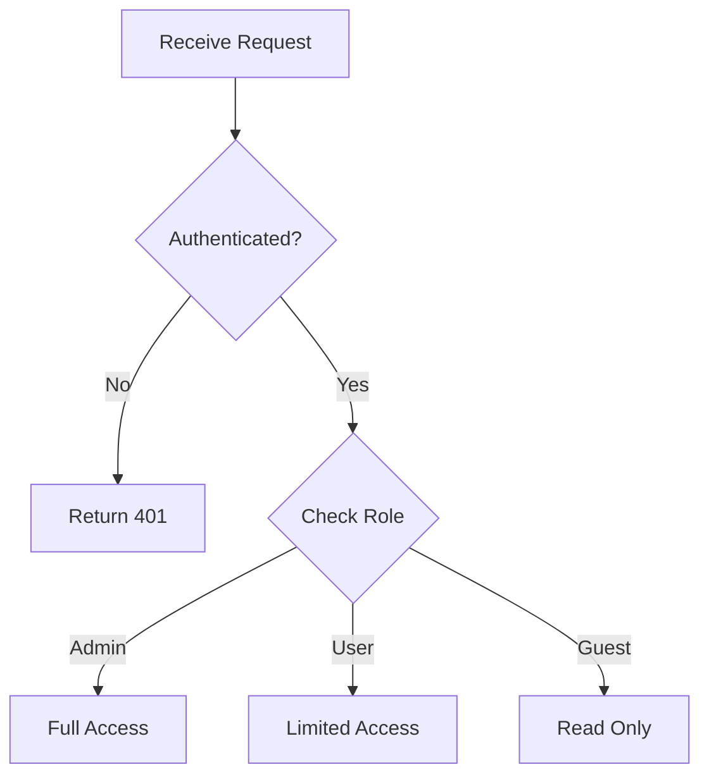

# Example Markdown with Mermaid Diagrams

This document demonstrates Mermaid diagram support in tui-diagrams.

## User Authentication Flow

Here's how user authentication works:

## API Request Flow

The sequence of events when making an API request:

## CI/CD Pipeline

Our deployment pipeline:

## Microservices Communication

## Decision Tree

